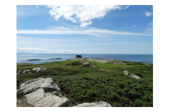

# Introduction to GIS for geologists

The background to GIS and an explanation of what it is will be covered in the lecture segment at the beginning of the class and the presentation and any other supporting materials will be available in Minerva.  The lecture segment should help you to understand why you are doing these exercises.  If you still aren't sure, please ask Clare.

## Learning outcomes

When you have completed this section of the workbook you should be able to:

* demonstrate how to open a map project in ArcGIS
* select appropriate tools to navigate in a map document
* use layers to organise and display information on a map
* add information to a layout and prepare it for printing or display
* demonstrate different ways of finding help when using GIS

### Welcome to this module

There will be some text here

#### And another heading

This is to see how far the index will go

## Introduction

As a GIS specialist you have been asked by the Field Studies Council to produce a geological map of the area around the Malham Tarn National Nature Reserve (NNR).

For this first exercise I have created a basic geological map of Malham Tarn so that you can explore the GIS application and get used to basic navigation and functions. In future sessions you'll be preparing the data and setting up the basics for yourself.

For now go to [Minerva](https://minerva.leeds.ac.uk) and download the files.

Here is a pretty picture of Rhoscolyn.

